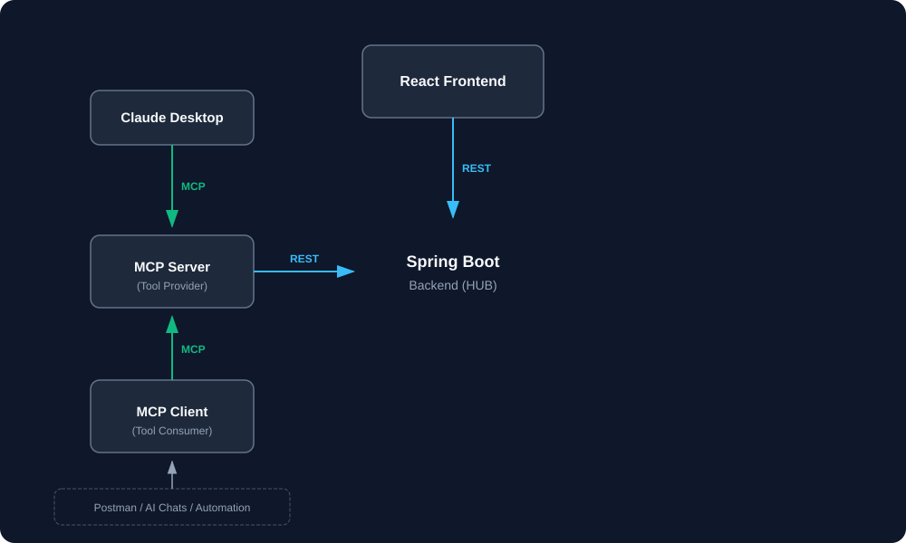
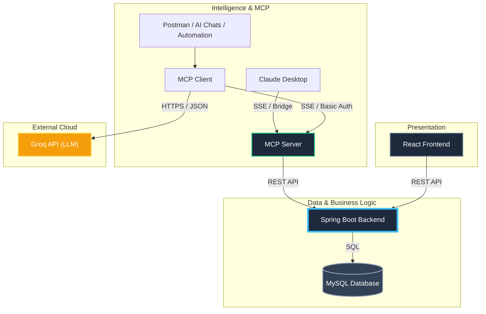

# Intelligent E-Commerce Platform with MCP & AI

A modern, full-stack E-Commerce solution that integrates standard RESTful architecture with **Generative AI** and the **Model Context Protocol (MCP)**. This project demonstrates how to build a "smart" application where an AI assistant can actively query your database to answer user requests.

---

## 🏗️ System Architecture



The system follows a **hub-and-spoke** architecture where the **Spring Boot Backend** acts as the central data and logic hub.



### 🔄 How It Works
*   **Central Hub**: The Spring Boot backend manages the core database (MySQL) and provides REST APIs. It is reactive but never initiates external connections.
*   **Web Access**: The React frontend interacts with the backend strictly via REST APIs for catalog and user management.
*   **AI Integration**:
    *   **MCP Server**: Acts as a bridge, exposing backend tools (searching, details) to the AI layer via REST.
    *   **MCP Client / Claude**: Connect to the MCP Server using the **Model Context Protocol**, allowing AI models to "use" the backend tools.
    *   **Automation**: Tools like Postman or other bots connect through the MCP Client to leverage AI-orchestrated tasks.

### 🍱 Modules

| Module | Role | Tech Stack | Port |
| :--- | :--- | :--- | :--- |
| **[`ecom-proj`](./ecom-proj)** | **Core Backend Hub** | Spring Boot, MySQL | `8080` (REST) |
| **[`ecom-ai/mcp-server`](./ecom-ai/mcp-server)** | **MCP Tool Server** | Spring AI, MCP, Basic Auth | `9091` (SSE) |
| **[`ecom-ai/mcp-client`](./ecom-ai/mcp-client)** | **AI Assistant Client** | Spring AI, Groq, Basic Auth | `9090` (Web) |
| **[`ecom-frontend`](./ecom-frontend)** | **Interactive Web UI** | React 18, Vite | `5173` |

---

## ✨ Key Features

### 🤖 Intelligent AI Assistant
- **Groq API Integration** with automatic model rotation
- **18 Available Models** from the Groq ecosystem
- **Automatic Failover**: When rate limits are hit, the system automatically switches to the next available model
- **Smart Context**: AI has access to real-time product data via MCP tools

### 📊 Advanced Logging
- **Request Logging**: All HTTP requests are logged with method and URI
- **Dual Output**: Logs appear in both terminal windows and log files
- **Service-Specific Prefixes**: `[BACKEND-REQUEST]`, `[MCP-SERVER-REQUEST]`, `[MCP-CLIENT-REQUEST]`, `[Request]` (Frontend)
- **Centralized Log Directory**: All logs stored in `./Logs/`

### 🚀 One-Click Startup
- **Automated Launch Script**: `run_all.bat` starts all services in sequence
- **Automatic Log Monitoring**: Dedicated PowerShell window for real-time log aggregation
- **Intelligent Delays**: Services wait for dependencies to initialize

---

## 🚀 Getting Started

### 1. Prerequisites
*   **Java 21 JDK**
*   **Node.js** (v18 or higher)
*   **MySQL Server** (Running locally)
*   **Groq API Key** (Free tier available at [console.groq.com](https://console.groq.com))

### 2. Database Setup
Create a standardized database in your MySQL instance:
```sql
CREATE DATABASE springbootdb;
```
*(The backend will automatically create tables on the first run, or you can use the provided SQL scripts if available).*

### 3. Configure API Key
Update the Groq API key in `ecom-ai/mcp-client/src/main/resources/application.properties`:
```properties
spring.ai.openai.api-key=YOUR_GROQ_API_KEY_HERE
```

### 4. Running the Application

#### Option 1: Automated Startup (Recommended)
Simply run the batch file from the project root:
```bash
run_all.bat
```

This will:
1. Clear and initialize log files
2. Start the Frontend (Port 5173)
3. Start the Core Backend (Port 8080)
4. Start the MCP Server (Port 9091)
5. Start the MCP Client (Port 9090)
6. Launch a Log Monitor window

#### Option 2: Manual Startup (4 Terminals)

**Terminal 1: Core Backend**
```bash
cd ecom-proj
mvnw spring-boot:run
```

**Terminal 2: MCP Server**
```bash
cd ecom-ai/mcp-server
mvnw spring-boot:run
```

**Terminal 3: MCP Client**
```bash
cd ecom-ai/mcp-client
mvnw spring-boot:run
```

**Terminal 4: Frontend**
```bash
cd ecom-frontend
npm install   # First time only
npm run dev
```

---

## 🧪 Usage

1.  Open your browser to **[http://localhost:5173](http://localhost:5173)**.
2.  **Browse**: View the product gallery loaded from the Core Backend.
3.  **Chat**: Click the specific "Chat" or "Ask AI" button.
    *   *Try asking:* "Do you have any wireless headphones?"
    *   *Try asking:* "What is the cheapest item in store?"
    *   *Try asking:* "Recommend a laptop for work."

The AI will intelligently query the database and give you a factual answer based on real inventory.

---

## 🔧 Configuration

### Model Rotation
Available models are defined in `ecom-ai/mcp-client/src/main/resources/groq_models.json`. The system will automatically:
1. Load all non-audio models on startup
2. Rotate to the next model when rate limits are encountered
3. Log model switches for transparency

**Current Model Hierarchy** (18 models):
1. meta-llama/llama-guard-4-12b (Primary)
2. allam-2-7b
3. meta-llama/llama-4-scout-17b-16e-instruct
4. qwen/qwen3-32b
5. openai/gpt-oss-120b
6. moonshotai/kimi-k2-instruct-0905
7. ... (and 12 more)

### Logging Configuration
Logs are stored in `./Logs/`:
- `spring_backend.log` - Core backend requests and operations
- `mcp_server.log` - MCP server tool invocations
- `mcp_client.log` - AI chat requests and responses
- `react_frontend.log` - Frontend dev server activity

---

## 🤖 Model Context Protocol (MCP)

The `ecom-ai` service is a compliant **MCP Server**. This means you can connect external AI agents (like the **Claude Desktop App**) to this service to let an external AI manage your store data.

### 🌉 The Bridge Script
Since Claude Desktop expects a **Stdio** connection and our Spring Boot server provides an **SSE** (Web) connection, we use a local bridge script:
*   **Bridge File**: `ecom-ai/mcp-bridge.js`
*   **Role**: Proxies JSON-RPC messages between Claude and the Spring server.

### ⚙️ Claude Desktop Configuration
To use with Claude Desktop, add this to your `%APPDATA%\Claude\claude_desktop_config.json`:

```json
{
  "mcpServers": {
    "ecom-ai": {
      "command": "node",
      "args": [
        "C:/path/to/your/ecommerce/ecom-ai/mcp-server/mcp-bridge.js",
        "http://localhost:9091/sse"
      ]
    }
  }
}
```
*(Replace `C:/path/to/your/` with your actual absolute path).*

### 🛠️ Tools Exposed to AI
*   `searchProducts`: Find items by keywords.
*   `getProductDetails`: Get full information about a specific product.
*   `listAllProducts`: Get a full inventory list.
*   `getUserActivity`: (Internal) Analyze database metrics.
*   `getCurrentTime`: System utility.

---

## 🐛 Troubleshooting

### Services Won't Start
- Ensure MySQL is running on `localhost:3306`
- Check that ports 5173, 8080, 9090, 9091 are available
- Verify Java 21 and Node.js are installed correctly

### Rate Limit Errors
- The system automatically rotates through 18 models
- Check `mcp_client.log` for model rotation messages
- If all models fail, wait for the rate limit window to reset (usually 1 minute)

### No Logs Appearing
- Check that `Tee-Object` is working in PowerShell (Windows only)
- Verify log files exist in `./Logs/` directory
- Ensure services have write permissions to the Logs folder

---

## 📚 Related Projects

- [SpringAI_Test](https://github.com/malcolm-cephas/SpringAI_Test) - MCP Client/Server Architecture
- [opencode-antigravity-autopilot](https://github.com/Gooseware/opencode-antigravity-autopilot) - Model Switching Inspiration

---

## 🤝 Contributing
Feel free to fork this repository and submit pull requests. For major changes, please open an issue first to discuss what you would like to change.
