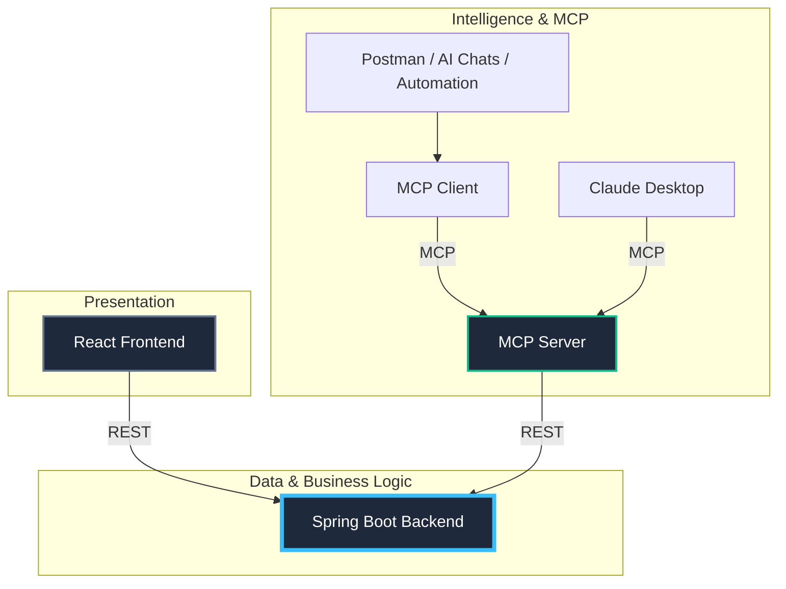

# Intelligent E-Commerce Platform with MCP & AI

A modern, full-stack E-Commerce solution that integrates standard RESTful architecture with **Generative AI** and the **Model Context Protocol (MCP)**. This project demonstrates how to build a "smart" application where an AI assistant can actively query your database to answer user requests.

---

## 🏗️ System Architecture


The system follows a **hub-and-spoke** architecture where the **Spring Boot Backend** acts as the central data and logic hub.



### 🔄 How It Works
*   **Central Hub**: The Spring Boot backend manages the core database (MySQL) and provides REST APIs. It is reactive but never initiates external connections.
*   **Web Access**: The React frontend interacts with the backend strictly via REST APIs for catalog and user management.
*   **AI Integration**:
    *   **MCP Server**: Acts as a bridge, exposing backend tools (searching, details) to the AI layer via REST.
    *   **MCP Client / Claude**: Connect to the MCP Server using the **Model Context Protocol**, allowing AI models to "use" the backend tools.
    *   **Automation**: Tools like Postman or other bots connect through the MCP Client to leverage AI-orchestrated tasks.

### 🍱 Modules

| Module | Role | Tech Stack | Port |
| :--- | :--- | :--- | :--- |
| **[`ecom-proj`](./ecom-proj)** | **Core Backend** | Spring Boot, MySQL | `8080` (REST) |
| **[`ecom-ai/mcp-server`](./ecom-ai/mcp-server)** | **MCP Server** | Spring AI, MCP | `9091` (SSE) |
| **[`ecom-ai/mcp-client`](./ecom-ai/mcp-client)** | **MCP Client / Chat** | Spring AI, React | `9090` (Web) |
| **[`ecom-frontend`](./ecom-frontend)** | **User Interface** | React 18, Vite | `5173` |

---

## 🚀 Getting Started

Follow these steps to run the full stack locally.

### 1. Prerequisites
*   **Java 21 JDK**
*   **Node.js** (v18 or higher)
*   **MySQL Server** (Running locally)
*   **Groq API Key** (or OpenAI Key) for the AI service.

### 2. Database Setup
Create a standardized database in your MySQL instance:
```sql
CREATE DATABASE springbootdb;
```
*(The backend will automatically create tables on the first run, or you can use the provided SQL scripts if available).*

### 3. Running the Application (Requires 4 Terminals)

#### Terminal 1: Core Backend (`ecom-proj`)
Initialize the main API server.
```bash
cd ecom-proj
mvn spring-boot:run
```
> Wait for `Started EcomProjApplication using Java 21...` on port `8080`.

#### Terminal 2: MCP Server (`ecom-ai/mcp-server`)
Initialize the tool provider.
```bash
cd ecom-ai/mcp-server
mvn spring-boot:run
```
> Wait for `Started McpServerApplication...` on port `9091`.

#### Terminal 3: MCP Client (`ecom-ai/mcp-client`)
Initialize the AI chat service.
```bash
cd ecom-ai/mcp-client
mvn spring-boot:run
```
> Wait for `Started McpClientApplication...` on port `9090`.

#### Terminal 4: Frontend (`ecom-frontend`)
Launch the user interface.
```bash
cd ecom-frontend
npm install   # First time only
npm run dev
```
> Access at `http://localhost:5173`.

---

## 🧪 Usage

1.  Open your browser to **[http://localhost:5173](http://localhost:5173)**.
2.  **Browse**: View the product gallery loaded from the Core Backend.
3.  **Chat**: Click the specific "Chat" or "Ask AI" button.
    *   *Try asking:* "Do you have any wireless headphones?"
    *   *Try asking:* "What is the cheapest item in store?"
    *   *Try asking:* "Recommend a laptop for work."

The AI will intelligently query the database and give you a factual answer based on real inventory.

---

## 🤖 Model Context Protocol (MCP)

The `ecom-ai` service is a compliant **MCP Server**. This means you can connect external AI agents (like the **Claude Desktop App**) to this service to let an external AI manage your store data.

### 🌉 The Bridge Script
Since Claude Desktop expects a **Stdio** connection and our Spring Boot server provides an **SSE** (Web) connection, we use a local bridge script:
*   **Bridge File**: `ecom-ai/mcp-bridge.js`
*   **Role**: Proxies JSON-RPC messages between Claude and the Spring server.

### ⚙️ Claude Desktop Configuration
To use with Claude Desktop, add this to your `%APPDATA%\Claude\claude_desktop_config.json`:

```json
{
  "mcpServers": {
    "ecom-ai": {
      "command": "node",
      "args": [
        "C:/path/to/your/ecommerce/ecom-ai/mcp-server/mcp-bridge.js",
        "http://localhost:9091/sse"
      ]
    }
  }
}
```
*(Replace `C:/path/to/your/` with your actual absolute path).*

### 🛠️ Tools Exposed to AI
*   `searchProducts`: Find items by keywords.
*   `getProductDetails`: Get full information about a specific product.
*   `listAllProducts`: Get a full inventory list.
*   `getUserActivity`: (Internal) Analyze database metrics.
*   `getCurrentTime`: System utility.

---

## 🤝 Contributing
Feel free to fork this repository and submit pull requests. For major changes, please open an issue first to discuss what you would like to change.
