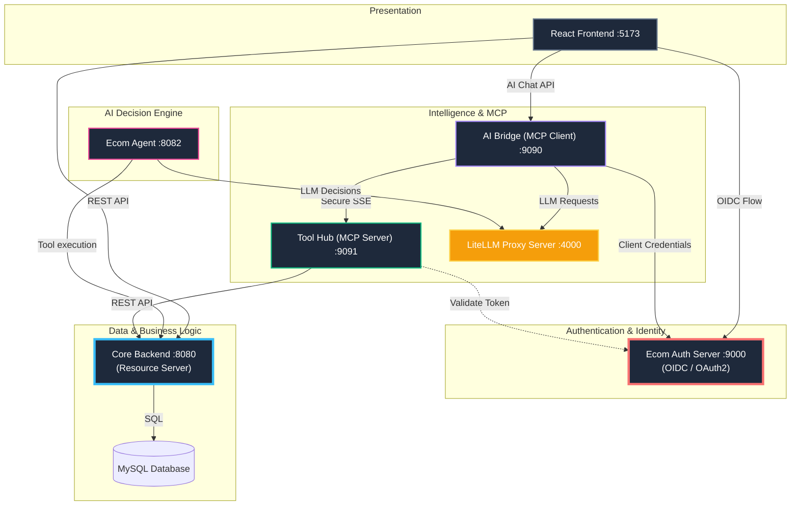

# Intelligent E-Commerce Platform with MCP & AI

A modern, full-stack E-Commerce solution that integrates standard RESTful architecture with **Generative AI** and the **Model Context Protocol (MCP)**. This project demonstrates how to build a "smart" application where an autonomous AI agent can actively query your database to fulfill user shopping requests.

---

## 🏗️ System Architecture
The system follows a **distributed service** architecture where the **Ecom Auth Server** manages identities, the **Spring Backend** acts as the core resource hub, and the AI components handle decision-making and external integrations.



### 🔄 How It Works
*   **Central Hub**: The Spring Boot backend manages the core database (MySQL) and provides REST APIs.
*   **Web Access**: The React frontend interacts with the backend for catalog and user management.
*   **Autonomous Agent**: The `Ecom Agent` acts as the system's brain, capable of understanding complex user requests, parsing catalogs, checking stock, and returning intelligent recommendations.
*   **MCP Integration**: 
    *   **MCP Server**: Exposes backend tools (search, details, stats) to external AI clients via the Model Context Protocol.
    *   **MCP Client**: A bridge that allows external AI systems (like Claude Desktop) to connect securely to your environment.
*   **LLM Routing**: The system utilizes a **LiteLLM Proxy Server** to handle LLM requests, providing centralized failover, retries, and API key management.

### 🍱 Modules

| Module | Role | Tech Stack | Port |
| :--- | :--- | :--- | :--- |
| **[`ecom-auth-server`](./ecom-auth-server)** | **Identity Provider** | OIDC, OAuth2, JWT | `9000` |
| **[`ecom-proj`](./ecom-proj)** | **Core Backend Hub** | Resource Server, MySQL | `8080` |
| **[`ecom-ai/mcp-server`](./ecom-ai/mcp-server)** | **MCP Tool Server** | Spring AI, OAuth2 Auth Srv | `9091` |
| **[`ecom-ai/mcp-client`](./ecom-ai/mcp-client)** | **AI Bridge Client** | Spring AI, Groq | `9090` |
| **[`ecom-agent`](./ecom-agent)** | **Autonomous Shopping Agent** | Spring AI, LiteLLM | `8082` |
| **[`ecom-frontend`](./ecom-frontend)** | **Interactive Web UI** | React 18, OIDC Client | `5173` |

---

## ✨ Key Features

### 🤖 Intelligent AI Assistant
- **LiteLLM Proxy Integration**: Centralized LLM management.
- **Autonomous Decision Engine**: The Ecom Agent can string together multiple tool calls to fulfill complex user constraints before responding.
- **Legacy Fallback**: Original Groq/OpenRouter JSON model parsing logic is preserved as a legacy fallback mechanism.

### 📊 Advanced Logging
- **Request Logging**: All HTTP requests are logged with method and URI.
- **Centralized Log Directory**: All service logs are stored in `./Logs/` and aggregated in a master monitoring window.

### 🚀 One-Click Startup
- **Automated Launch Script**: `run_all.bat` starts all services in sequence.
- **Intelligent Delays**: Services wait for dependencies to initialize.

---

## 🚀 Getting Started

### 1. Prerequisites
*   **Java 21 JDK**
*   **Node.js** (v18 or higher)
*   **MySQL Server** (Running locally)
*   **LiteLLM Proxy Server** (Running locally on port 4000)

### 2. Database Setup
Create a standardized database in your MySQL instance:
```sql
CREATE DATABASE springbootdb;
```

### 3. LiteLLM Proxy Setup
Ensure your LiteLLM Proxy is configured and running on `http://localhost:4000`. This proxy should handle API keys for your target models (e.g., Groq, OpenRouter).

### 4. Running the Application

#### Option 1: Automated Startup (Recommended)
Simply run the batch file from the project root:
```bash
run_all.bat
```

This will automatically:
1. Start the **Frontend** (Port 5173)
2. Start the **Core Backend** (Port 8080)
3. Start the **MCP Server** (Port 9091)
4. Start the **MCP Client** (Port 9090)
5. Start the **Ecom Agent** (Port 8082)
6. Launch a real-time **Log Monitor** window

#### Option 2: Manual Startup (5 Terminals)
If you prefer to start services individually, you can use `mvnw spring-boot:run` within each respective module directory (and `npm run dev` for the frontend).

---

## 🧪 Usage

1. Open your browser to **[http://localhost:5173](http://localhost:5173)**.
2. **Browse**: View the product gallery.
3. **Chat**: Click the "Ask AI" button.
    *   *Try asking:* "Find me a cheap laptop under $500."
    *   *Try asking:* "Do you have wireless headphones in stock?"

---

## 🔧 Configuration

### Model Routing & Legacy Support
The system is configured to route all LLM requests through the LiteLLM Proxy at `http://localhost:4000`. 

**Legacy Support**: If you choose to bypass LiteLLM, the system retains legacy configurations (`groq_models.json` and `openrouter_models.json`) which can be used to manually orchestrate internal model fallback logic across 18+ models.

---

## 🤖 Model Context Protocol (MCP)
The `ecom-ai/mcp-server` is a compliant **MCP Server**. This means you can connect external AI agents (like **Claude Desktop**) to let an external AI manage your store data.

### ⚙️ Claude Desktop Configuration
To use with Claude Desktop, add this to your `%APPDATA%\Claude\claude_desktop_config.json`:

```json
{
  "mcpServers": {
    "ecom-ai": {
      "command": "node",
      "args": [
        "C:/path/to/your/ecommerce/ecom-ai/mcp-server/mcp-bridge.js",
        "http://localhost:9091/sse"
      ]
    }
  }
}
```

## 🤝 Contributing
Feel free to fork this repository and submit pull requests. For major changes, please open an issue first to discuss what you would like to change.