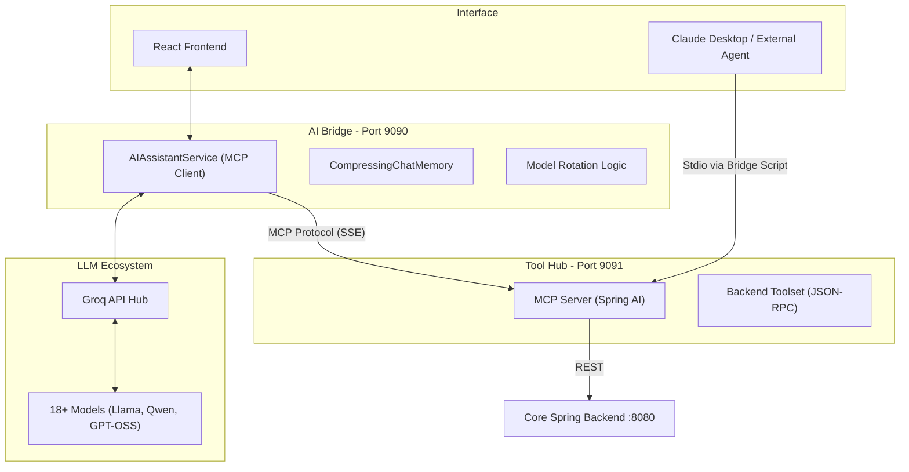

# 🤖 Intelligent Agents & MCP Integration

This document outlines the architecture, roles, and configuration of the AI agents powered by the **Model Context Protocol (MCP)** within the Intelligent E-Commerce Platform.

---

## 🏛️ Agent Architecture

The system utilizes a multi-agent orchestration layer that separates the "brain" (LLM) from the "tools" (API resources).



---

## 🎭 Key Agent Roles

### 1. E-Commerce Shopping Assistant
The primary consumer-facing agent designed to assist users with their shopping journey. 
- **Internal Name**: `AIAssistantService`
- **Service**: `ecom-ai/mcp-client`
- **Capabilities**: 
    - **Natural Language Search**: "Find me blue sneakers under $50."
    - **Inventory Analysis**: "Which category has the most items?"
    - **Customer Insights**: (Internal) Review user activity trends.

### 2. MCP Tool Server (Resource Provider)
A non-autonomous "worker" agent that provides the AI with structured access to the platform's data. 
- **Internal Name**: `McpToolServer`
- **Service**: `ecom-ai/mcp-server`
- **Exposed Tools**:
    - `searchProducts`: Text-based semantic search for inventory.
    - `getProductDetails`: Deep dive into specific item specs and pricing.
    - `listAllProducts`: Batch inventory retrieval.
    - `getProductStatistics`: Statistical analysis of product categories.
    - `getUserActivity`: Analytical access to database metrics and login trends.
    - `getCurrentTime`: Time utility for context-aware responses.

---

## 🧠 Smart Management Features

### 🔄 Dynamic Model Rotation
To ensure 100% uptime and bypass rate limits, the AI Bridge implements an **Automatic Failover** system:
- **Strategy**: It monitors Groq API responses. If a `429 Too Many Requests` is encountered, it seamlessly rotates to the next available model in the `groq_models.json` hierarchy.
- **Breadth**: Access to 18+ state-of-the-art models including `Llama 4 Scout`, `Qwen 3`, and `GPT-OSS`.

### 💾 Chat Memory & Lifecycle
The platform manages agent interactions through a persistent lifecycle:
- **CompressingChatMemory**: Automatically summarizes older parts of a conversation to fit more relevant "current" context into the LLM's window.
- **Auto-Description**: When a new chat starts, the agent automatically generates a 30-character title based on the first query.
- **Persistence**: Chat history and session metadata are stored in the core database via `ChatMetadataRepository`.
- **System Prompting**: Agents are initialized with a strict "E-Commerce Expert" persona to prevent hallucination outside the product domain.

---

## 🌉 External Agent Integration (BYOA)

You can "Bring Your Own Agent" by connecting external tools like the **Claude Desktop App** to our Tool Hub.

### 1. The Bridge Script
Since external agents often use **Stdio** while our server uses **WebSockets/SSE**, we provide a proxy:
- **File**: `ecom-ai/mcp-server/mcp-bridge.js`
- **Command**: `node ./mcp-bridge.js http://localhost:9091/sse`

### 2. Claude Desktop Config
Add this to your `claude_desktop_config.json`:
```json
{
  "mcpServers": {
    "ecom-store-manager": {
      "command": "node",
      "args": [
          "C:/path/to/ecommerce/ecom-ai/mcp-server/mcp-bridge.js",
          "http://localhost:9091/sse"
      ]
    }
  }
}
```

---

## 🛠️ Developing New Tools
To add a new capability to the agents:
1. Open `ecom-ai/mcp-server`.
2. Add a new method in the tool configuration with the `@Tool` or appropriate Spring AI annotation.
3. The AI Bridge will automatically discover the tool via the MCP protocol on the next restart.
